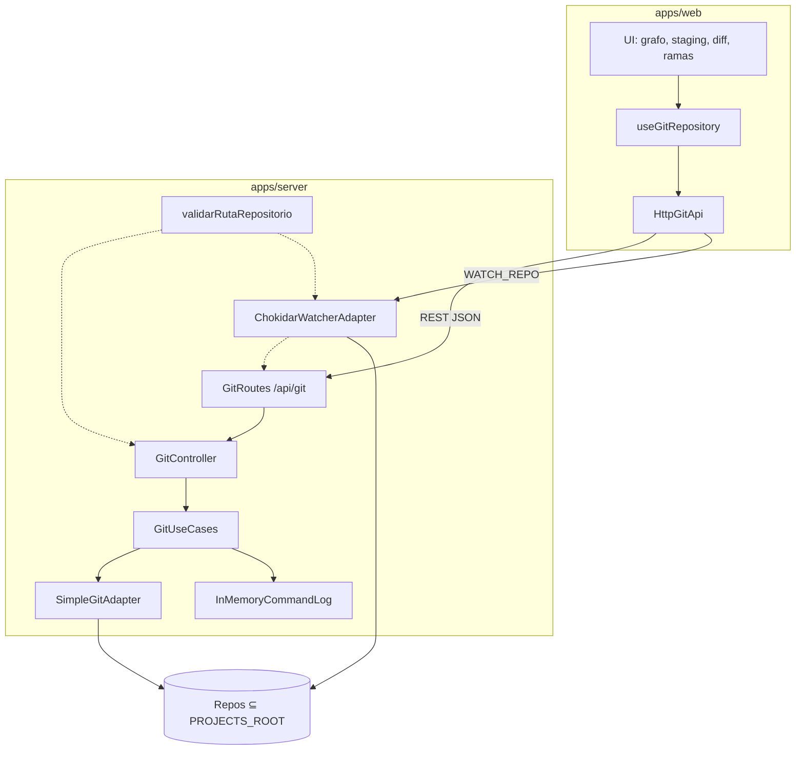

   


# Abyssan

**El grafo, el staging y la red de seguridad de un cliente Git de escritorio — en el navegador, en tu máquina, sin suscripción.**

Abyssan es un cliente gráfico auto-hospedable. Un backend Node opera los repositorios locales;  
una SPA React muestra el DAG, prepara el commit y ejecuta merge, stash y conflictos sin terminal.

**[Inicio rápido](#inicio-rapido)**  ·  **[Arquitectura](#arquitectura)**  ·  **[Capacidades](#capacidades)**  ·  **[Documentación](#documentacion)**  ·  **[Licencia](#licencia)**

---


## Por qué existe

Git no se paga por “hacer `git`”. Se paga por tres cosas que el CLI resuelve mal:


| Pilar                  | Problema                                                          | Promesa de Abyssan                                                 |
| ---------------------- | ----------------------------------------------------------------- | ------------------------------------------------------------------ |
| **Leer historia**      | El log lineal no explica merges, HEAD ni el remoto de un vistazo. | Un **DAG** con lanes, refs y contexto.                             |
| **Preparar el commit** | `git add -p` es potente y frágil.                                 | Staging visual, diff inmediato, commit consciente.                 |
| **No romper el repo**  | Un reset o un merge mal leído cuesta horas.                       | Confirmaciones, estado visible, undo en el horizonte del producto. |


**No es** un host de repositorios, un GitHub web, ni un clon de Boards / Insights / Teams. Es un **cliente Git local** con la densidad de un producto profesional y el código bajo control del usuario.

> **Norte del producto.** Tres capas, en escalera: *local* → *power* (hunks, rebase visual, blame) → *forjas* (OAuth y PRs/MRs). El primer “listo” es el **Daily Driver v1**: un día laboral a nivel archivo, gratis y auto-hospedable.

---


## Interfaz


Esquema de producto (no es una captura). Layout de tres columnas, tema oscuro, escritorio-first (≥ 1280 px).


| Zona               | Rol                                                                        |
| ------------------ | -------------------------------------------------------------------------- |
| **Barra superior** | Selector de repositorio, sync (fetch / pull / push) y acciones globales.   |
| **Sidebar**        | Ramas locales y remotas, tags, checkout y creación de referencias.         |
| **Grafo**          | Historia como DAG: commits, padres múltiples, etiquetas HEAD / rama / tag. |
| **Staging + diff** | Unstaged / staged, visor de cambios y formulario de commit.                |


---


## Capacidades

Superficie actual del repositorio frente al Daily Driver.


| Dominio                           | Hoy                                 | Daily Driver                       |
| --------------------------------- | ----------------------------------- | ---------------------------------- |
| Repositorios bajo `PROJECTS_ROOT` | Listado (un nivel)                  | Clone, init, selector              |
| Grafo DAG                         | Interactivo (esqueleto)             | Virtualizado, lanes de merge       |
| Stage / unstage / commit          | Por archivo                         | Por archivo + discard + amend      |
| Diff                              | Unificado con `+` / `-`             | Syntax highlight + split           |
| Ramas y tags                      | Listar, checkout, crear             | Borrar, renombrar, tracking        |
| Sync                              | Pull / push, CRUD de remotos, fetch | Fetch en header, pull merge/rebase |
| Stash                             | Save / pop / drop                   | + apply                            |
| Merge y comparación               | Merge `--no-ff`, compare            | + abort                            |
| Conflictos                        | Resolución básica                   | 3-way multi-hunk                   |
| Cherry-pick / revert / reset      | Soft / hard                         | + mixed + undo                     |
| Tiempo real                       | WebSocket + chokidar                | Debounce estable                   |
| Autenticación                     | Localhost (sin auth)                | Token si se publica en LAN         |


Operaciones Git disponibles en API hoy: status, log, diff, stage, commit, checkout, branch, tag, stash, merge, cherry-pick, revert, reset, fetch, push, pull, remotos y conflictos.

---


## Stack

Monorepo **pnpm workspaces**. Sin base de datos en v1: estado en memoria, `localStorage` en el cliente y archivos de configuración locales.

```text
┌─────────────────────────────────────────────────────────────────┐
│                        apps/web  ·  :5174                       │
│         React 19  ·  TypeScript  ·  Vite 6  ·  Tailwind 4       │
│              Lucide  ·  date-fns  ·  WebSocket client           │
└────────────────────────────┬────────────────────────────────────┘
                             │  REST  /api/git/*     WS  REPO_CHANGED
┌────────────────────────────▼────────────────────────────────────┐
│                      apps/server  ·  :3001                      │
│     Node.js  ·  Express  ·  TypeScript  ·  simple-git           │
│              ws  ·  chokidar  ·  validación de rutas            │
└────────────────────────────┬────────────────────────────────────┘
                             │
                             ▼
                    filesystem  ⊆  PROJECTS_ROOT
```


| Capa                | Tecnología                       | Notas                                                        |
| ------------------- | -------------------------------- | ------------------------------------------------------------ |
| Presentación        | React 19, Vite 6, Tailwind CSS 4 | Tema oscuro `#0f111a` / paneles `#181c2d` / acento `#10b981` |
| Aplicación (web)    | Hooks + `HttpGitApi`             | Un solo camino HTTP hacia el backend                         |
| Dominio (server)    | Entidades Git + casos de uso     | DDD ligero: sin Nest, sin GraphQL, sin DB                    |
| Infraestructura Git | `simple-git`                     | **Prohibido** `child_process.exec` genérico                  |
| Tiempo real         | `ws` + `chokidar`                | El socket notifica cambios; no envía contenido de archivos   |
| Calidad             | Vitest, oxlint                   | `pnpm test` · `pnpm lint` · `pnpm build`                     |
| Empaque             | Docker Compose                   | SPA + API; volumen de proyectos configurable                 |


**Gestor de paquetes:** solo `pnpm`. No usar `npm`, `npx` (en el runtime del proyecto) ni otros lockfiles.

---


## Arquitectura

El backend no es un wrapper de comandos. Las mutaciones Git atraviesan un único camino:

**HTTP →** `GitController` **→** `GitUseCases` **→** `SimpleGitAdapter`




### Contrato de API (objetivo)

Migración en curso hacia un envelope único. El cliente debe hablar el mismo contrato que el servidor.

```json
{
  "exito": true,
  "mensaje": "Commit creado",
  "datos": {},
  "meta": {}
}
```

Healthcheck: `[GET /health](http://localhost:3001/health)` → `{ "status": "ok", ... }`.

### Estructura del monorepo

```text
Abyssan/
├── apps/
│   ├── web/                 # SPA React
│   │   └── src/
│   │       ├── application/ # hooks de orquestación
│   │       ├── domain/      # modelos
│   │       ├── infrastructure/  # HttpGitApi, WebSocket
│   │       └── components/  # UI de producto
│   └── server/              # API Express
│       └── src/
│           ├── domain/
│           ├── application/
│           ├── infrastructure/  # git · seguridad · watcher · logging
│           └── interfaces/http
├── docs/                    # PRD, plan, assets
├── docker-compose.yml
└── pnpm-workspace.yaml
```

---

## Inicio rápido


### Requisitos


| Herramienta | Versión                  |
| ----------- | ------------------------ |
| Node.js     | 20 LTS o superior        |
| pnpm        | 9+                       |
| Git         | En el `PATH` del sistema |
| Docker      | Opcional, para Compose   |


### 1. Instalar

```bash
pnpm install
```


### 2. Configurar

Copia `.env.example` a `.env` en la raíz y define la raíz de repositorios. **Abyssan no opera fuera de ese directorio.**

```env
PROJECTS_ROOT=C:\Users\<usuario>\proyectos
PORT=3001
NODE_ENV=development
VITE_API_URL=http://localhost:3001
VITE_WS_URL=ws://localhost:3001
```


| Variable        | Rol                                            |
| --------------- | ---------------------------------------------- |
| `PROJECTS_ROOT` | Única raíz permitida para listar y mutar repos |
| `PORT`          | HTTP y WebSocket del servidor (3001)           |
| `VITE_API_URL`  | Origen REST del frontend                       |
| `VITE_WS_URL`   | Origen WebSocket del frontend                  |


En Linux o dentro de Docker: `PROJECTS_ROOT=/workspace/proyectos`.

### 3. Arrancar

Dos procesos. El orden importa: el API debe estar vivo antes de usar la UI.

```bash
pnpm dev:server    # http://localhost:3001
pnpm dev:web       # http://localhost:5174
```

Abre **[http://localhost:5174](http://localhost:5174)**, elige un repositorio bajo `PROJECTS_ROOT` y trabaja sobre el grafo.


| Script            | Qué hace                                  |
| ----------------- | ----------------------------------------- |
| `pnpm dev:server` | API + WebSocket en caliente (`tsx watch`) |
| `pnpm dev:web`    | Vite HMR                                  |
| `pnpm build`      | Compila server y web                      |
| `pnpm lint`       | oxlint                                    |
| `pnpm test`       | Vitest                                    |


### Docker Compose

```bash
docker compose up --build
```


| Servicio | URL                                            |
| -------- | ---------------------------------------------- |
| Interfaz | [http://localhost:5174](http://localhost:5174) |
| API      | [http://localhost:3001](http://localhost:3001) |


El contenedor del servidor monta la carpeta de proyectos en `PROJECTS_ROOT=/workspace/proyectos`. Para **commit, push y el resto de escrituras Git**, el volumen debe ser de lectura-escritura.

---


## Seguridad

Abyssan ejecuta Git sobre el filesystem del host. El modelo de amenaza de Daily Driver es deliberadamente estrecho.


| Control                  | Comportamiento                                                                                |
| ------------------------ | --------------------------------------------------------------------------------------------- |
| Sandbox de rutas         | Todo `repoPath` pasa por `validarRutaRepositorio`. Fuera de `PROJECTS_ROOT` → **403**.        |
| Superficie Git           | Solo operaciones vía `simple-git`. Sin shell arbitrario.                                      |
| Operaciones destructivas | Reset hard (y equivalentes) exigen confirmación en UI.                                        |
| WebSocket                | Valida `WATCH_REPO`. Emite eventos de cambio, no diffs ni secretos.                           |
| Credenciales             | No se versionan. SSH usa el agent del sistema.                                                |
| Exposición de red        | Daily Driver asume **localhost**. Publicar `:3001` en LAN exige token de instancia (roadmap). |


No copies `.env` al repositorio. No registres diffs completos en logs de producción.

---


## Roadmap

Estimaciones en **semanas-persona** de trabajo enfocado, no en calendario.

```text
  Fase 0          Fase 1               Fase 2            Fase 3         Fase 4
  higiene  ──►  Daily Driver v1  ──►  power           ──►  forjas   ──►  distro
  3–5 días       3–5 semanas          hunks · palette      OAuth         Compose
                 ▲                    rebase visual        PRs / MRs     Tauri
                 │
            PRIMER LISTO
         (flujo diario a nivel archivo)
```


| Fase               | Entregable                                                              |
| ------------------ | ----------------------------------------------------------------------- |
| **0 Higiene**      | Un env, un cliente HTTP, tests verdes, Docker RW, identidad **Abyssan** |
| **1 Daily Driver** | Clone/init, discard, 3-way, ramas, fetch, undo, grafo virtualizado      |
| **2 Power**        | Stage por hunk/línea, command palette, tabs, blame, rebase visual       |
| **3 Forjas**       | OAuth GitHub/GitLab y cola de pull/merge requests                       |
| **4 Distro**       | Imagen de producción; escritorio Tauri opcional                         |


Fuera del norte cercano: worktrees, LFS, submódulos, GPG, GitKraken Cloud.

---


## Principios de ingeniería

1. **Un adaptador Git.** `SimpleGitAdapter` → `GitUseCases` → `GitController`. Sin servicios paralelos.
2. **Una raíz.** `PROJECTS_ROOT` es la única frontera del filesystem.
3. **pnpm exclusivo.** Lockfile `pnpm-lock.yaml`.
4. **Español de producto.** UI, mensajes y nombres de negocio en español; términos Git de industria se mantienen cuando son estándar.
5. **Confirmación antes de destruir.** Hard reset, discard y force-with-lease no son un `window.confirm` accidental.
6. **Honestidad de estado.** Hoy es un prototipo avanzado (~flujo diario a nivel archivo). El Daily Driver es el primer “reemplazo de GitKraken local”, no el marketing del esqueleto.

Los packages internos aún usan el scope `@webkraken/*` mientras se completa el rename de identidad (Fase 0). El nombre comercial del producto es **Abyssan**.

---


## Licencia

Distribuido bajo **MIT**. Uso, copia, modificación y redistribución libres, con atribución.


Abyssan — historia legible, commits conscientes, repos intactos.