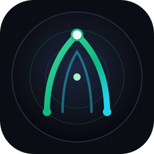
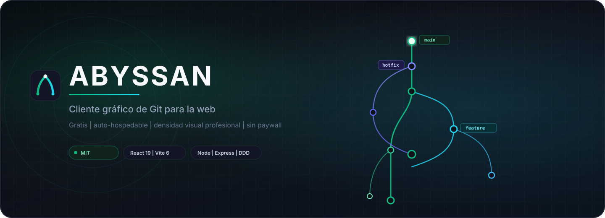
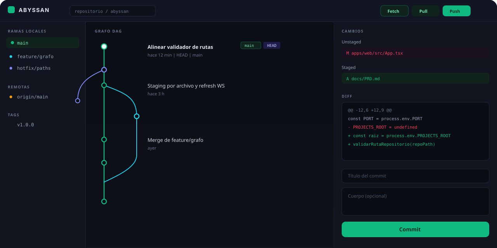
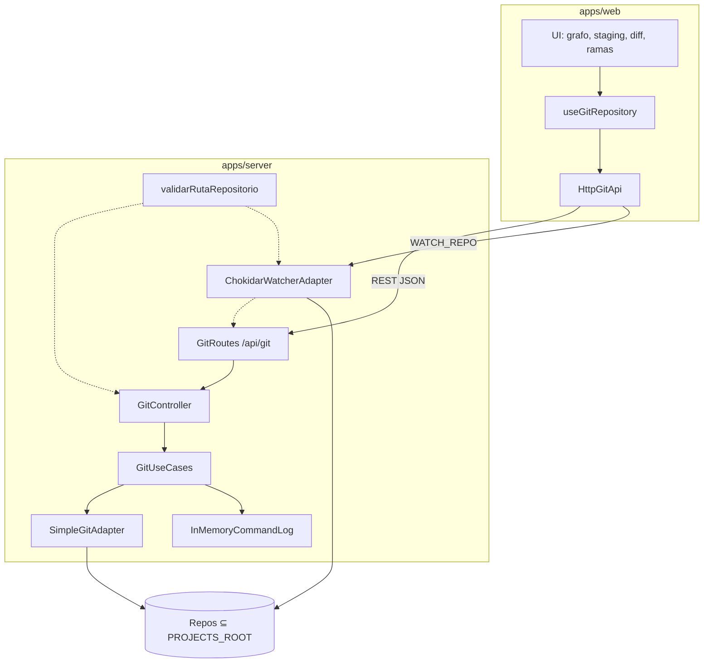

<p align="center">
  
</p>

# Abyssan

**El cliente Git que te ayuda a entender qué va a pasar antes de ejecutar — grafo, staging y red de seguridad, en el navegador, en tu máquina, sin suscripción.**

<p align="center">
  
</p>

Abyssan es un cliente gráfico auto-hospedable. Un backend Node opera los repositorios locales;  
una SPA React muestra el DAG, prepara el commit y —en el horizonte Identidad— enseña el efecto de un merge **antes** de ejecutarlo.

**[Inicio rápido](#inicio-rapido)**  ·  **[Arquitectura](#arquitectura)**  ·  **[Capacidades](#capacidades)**  ·  **[Documentación](#documentacion)**  ·  **[Licencia](#licencia)**

---


## Por qué existe

Git no se paga por “hacer `git`”. Los clientes gráficos maduros ya cubren el ratón. Abyssan se juega otra tesis: **Git visual + seguridad + comprensión**.


| Pilar                     | Problema                                                          | Promesa de Abyssan                                                      |
| ------------------------- | ----------------------------------------------------------------- | ----------------------------------------------------------------------- |
| **Ver historia**          | El log lineal no explica merges, HEAD ni el remoto de un vistazo. | Un **DAG** con lanes, refs y contexto.                                  |
| **Preparar el commit**    | `git add -p` es potente y frágil.                                 | Staging visual, diff inmediato, commit consciente.                      |
| **Entender antes**        | Un botón Merge no dice qué va a pasar.                            | Preview: mini-DAG, conflictos estimados, cancelar sin costo.            |
| **No romper el repo**     | Un reset o un merge mal leído cuesta horas.                       | Confirmación contextual, journal de undo, auditoría.                    |


**No es** un host de repositorios, un GitHub web, ni un clon de Boards / Insights / Teams. No es un producto de IA. Es un **cliente Git local** que enseña el efecto de una operación *antes* de ejecutarla.

> **Norte del producto.** Escalera ya recorrida: *local* → *power* → *forjas*. El siguiente “listo” es **Identidad**: preview, undo serio, modo aprendizaje y grafo que explica. Después: worktrees y forja como contexto de rama. Distro y plugins más tarde.

---


## Interfaz

<p align="center">
  
</p>

Esquema de producto (no es una captura). Layout de tres columnas, tema oscuro, escritorio-first (≥ 1280 px).


| Zona               | Rol                                                                        |
| ------------------ | -------------------------------------------------------------------------- |
| **Barra superior** | Selector de repositorio, sync (fetch / pull / push) y acciones globales.   |
| **Sidebar**        | Ramas locales y remotas, tags, checkout y creación de referencias.         |
| **Grafo**          | Historia como DAG: commits, padres múltiples, etiquetas HEAD / rama / tag. |
| **Staging + diff** | Unstaged / staged, visor de cambios y formulario de commit.                |


---


## Capacidades

Superficie actual (Fases 0–3 cerradas) frente al siguiente listo: **Identidad**.


| Dominio                           | Hoy (post Fase 3)                   | Identidad (Fase 4)                          |
| --------------------------------- | ----------------------------------- | ------------------------------------------- |
| Repositorios bajo `PROJECTS_ROOT` | Listado, clone, init, tabs          | + progreso de clone/fetch (ops largas)      |
| Grafo DAG                         | Virtualizado, lanes, búsqueda texto | Highlight, merge-base, camino, comparar A…B |
| Stage / unstage / commit          | Archivo + hunk + línea              | Igual (no-regresión)                        |
| Diff                              | Shiki + unified / split             | “Ver cambios” desde el preview              |
| Ramas y tags                      | CRUD, fetch, pull merge/rebase      | Preview antes de merge/rebase/reset         |
| Merge / rebase                    | Merge, abort, rebase visual         | Informe *antes* de ejecutar                 |
| Undo                              | Última operación en memoria         | Journal persistente + timeline              |
| Aprendizaje                       | No                                  | Explain Mode (plantillas, sin IA)           |
| Seguridad                         | Paths léxicos + token LAN           | realpath/symlinks, rate limit, auditoría    |
| Forjas                            | Modal PRs/MRs + OAuth               | Contexto de rama en Fase 5                  |
| Worktrees                         | No                                  | Fase 5                                      |


Operaciones Git disponibles en API hoy: status, log, diff, stage, commit, checkout, branch, tag, stash, merge, cherry-pick, revert, reset, fetch, push, pull, remotos, conflictos, hunks, blame, rebase, forjas.

---


## Stack

Monorepo **pnpm workspaces**. Sin base de datos en v1: estado en memoria, `localStorage` en el cliente y archivos de configuración locales.

```text
┌─────────────────────────────────────────────────────────────────┐
│                        apps/web  ·  :5174                       │
│         React 19  ·  TypeScript  ·  Vite 6  ·  Tailwind 4       │
│              Lucide  ·  date-fns  ·  WebSocket client           │
└────────────────────────────┬────────────────────────────────────┘
                             │  REST  /api/git/*     WS  REPO_CHANGED
┌────────────────────────────▼────────────────────────────────────┐
│                      apps/server  ·  :3001                      │
│     Node.js  ·  Express  ·  TypeScript  ·  simple-git           │
│              ws  ·  chokidar  ·  validación de rutas            │
└────────────────────────────┬────────────────────────────────────┘
                             │
                             ▼
                    filesystem  ⊆  PROJECTS_ROOT
```


| Capa                | Tecnología                       | Notas                                                        |
| ------------------- | -------------------------------- | ------------------------------------------------------------ |
| Presentación        | React 19, Vite 6, Tailwind CSS 4 | Tema oscuro `#0f111a` / paneles `#181c2d` / acento `#10b981` |
| Aplicación (web)    | Hooks + `HttpGitApi`             | Un solo camino HTTP hacia el backend                         |
| Dominio (server)    | Entidades Git + casos de uso     | DDD ligero: sin Nest, sin GraphQL, sin DB                    |
| Infraestructura Git | `simple-git`                     | **Prohibido** `child_process.exec` genérico                  |
| Tiempo real         | `ws` + `chokidar`                | El socket notifica cambios; no envía contenido de archivos   |
| Calidad             | Vitest, oxlint                   | `pnpm test` · `pnpm lint` · `pnpm build`                     |
| Empaque             | Docker Compose                   | SPA + API; volumen de proyectos configurable                 |


**Gestor de paquetes:** solo `pnpm`. No usar `npm`, `npx` (en el runtime del proyecto) ni otros lockfiles.

---


## Arquitectura

El backend no es un wrapper de comandos. Las mutaciones Git atraviesan un único camino:

**HTTP →** `GitController` **→** `GitUseCases` **→** `SimpleGitAdapter`




### Contrato de API

Envelope único. El cliente (`HttpGitApi`) habla el mismo contrato que el servidor.

```json
{
  "exito": true,
  "mensaje": "Commit creado",
  "datos": {},
  "meta": {}
}
```

Healthcheck: [GET /health](http://localhost:3001/health) → `{ "status": "ok", ... }`.

### Estructura del monorepo

```text
Abyssan/
├── apps/
│   ├── web/                 # SPA React
│   │   └── src/
│   │       ├── application/ # hooks de orquestación
│   │       ├── domain/      # modelos
│   │       ├── infrastructure/  # HttpGitApi, WebSocket
│   │       └── components/  # UI de producto
│   └── server/              # API Express
│       └── src/
│           ├── domain/
│           ├── application/
│           ├── infrastructure/  # git · seguridad · watcher · logging
│           └── interfaces/http
├── docs/                    # PRD, plan, assets
├── docker-compose.yml
└── pnpm-workspace.yaml
```

---

## Inicio rápido


### Requisitos


| Herramienta | Versión                  |
| ----------- | ------------------------ |
| Node.js     | 20 LTS o superior        |
| pnpm        | 9+                       |
| Git         | En el `PATH` del sistema |
| Docker      | Opcional, para Compose   |


### 1. Instalar

```bash
pnpm install
```


### 2. Configurar

Copia `.env.example` a `.env` en la raíz y define la raíz de repositorios. **Abyssan no opera fuera de ese directorio.**

```env
PROJECTS_ROOT=C:\Users\<usuario>\proyectos
PORT=3001
BIND_HOST=127.0.0.1
NODE_ENV=development
VITE_API_URL=http://localhost:3001
VITE_WS_URL=ws://localhost:3001
```


| Variable | Rol |
|----------|-----|
| `PROJECTS_ROOT` | Única raíz permitida para listar y mutar repos |
| `PORT` | HTTP y WebSocket del servidor (3001) |
| `BIND_HOST` | Default `127.0.0.1`. Si no es loopback, hay que definir token |
| `ABYSSAN_API_TOKEN` | Token de instancia (obligatorio fuera de localhost) |
| `VITE_API_URL` | Origen REST del frontend |
| `VITE_WS_URL` | Origen WebSocket del frontend |
| `VITE_ABYSSAN_API_TOKEN` | Mismo token, para que la SPA lo envíe |


En Linux o dentro de Docker: `PROJECTS_ROOT=/workspace/proyectos`.

### 3. Arrancar

Dos procesos. El orden importa: el API debe estar vivo antes de usar la UI.

```bash
pnpm dev:server    # http://localhost:3001
pnpm dev:web       # http://localhost:5174
```

Abre **[http://localhost:5174](http://localhost:5174)**, elige un repositorio bajo `PROJECTS_ROOT` y trabaja sobre el grafo.


| Script            | Qué hace                                  |
| ----------------- | ----------------------------------------- |
| `pnpm dev:server` | API + WebSocket en caliente (`tsx watch`) |
| `pnpm dev:web`    | Vite HMR                                  |
| `pnpm build`      | Compila server y web                      |
| `pnpm lint`       | oxlint                                    |
| `pnpm test`       | Vitest                                    |


### Atajos (Daily Driver)

| Atajo | Acción |
|-------|--------|
| `Ctrl+Enter` | Commit (con el formulario enfocado) |
| `Ctrl+Shift+A` | Stage all |
| `Ctrl+Shift+P` | Paleta mínima (fetch / pull / push / commit / PRs) |

Deshacer está en el header (hoy: última operación). El horizonte Identidad es un journal persistente + timeline, no una pila Ctrl+Z ciega. El reflog corto vive en el drawer de consola.


### Docker Compose

Desde la raíz del repositorio:

```bash
docker compose down
docker compose up --build
```

Solo el frontend (más rápido si el API ya está bien):

```bash
docker compose up --build -d web
```

Cuando ya esté reconstruido y solo quieras reiniciar procesos (sin instalar nada nuevo):

```bash
docker compose restart web
docker compose restart server
```

O por nombre de contenedor:

```bash
docker restart abyssan-web
docker restart abyssan-server
```

Ver que existen:

```bash
docker compose ps
```


| Servicio | URL                                            |
| -------- | ---------------------------------------------- |
| Interfaz | [http://127.0.0.1:5174](http://127.0.0.1:5174) |
| API      | [http://127.0.0.1:3001](http://127.0.0.1:3001) |


El contenedor del servidor monta proyectos en `PROJECTS_ROOT=/workspace/proyectos` **en lectura-escritura** (`ABYSSAN_PROJECTS_HOST`, por defecto el checkout). Compose publica los puertos solo en localhost del host. Como el proceso dentro del contenedor escucha `0.0.0.0`, **hace falta** `ABYSSAN_API_TOKEN` en `.env` (sin default). No re-publiques los puertos sin `127.0.0.1`.

---


## Seguridad

Abyssan ejecuta Git sobre el filesystem del host. El modelo de amenaza de Daily Driver es deliberadamente estrecho.


| Control                  | Comportamiento                                                                                |
| ------------------------ | --------------------------------------------------------------------------------------------- |
| Sandbox de rutas         | Todo `repoPath` pasa por `validarRutaRepositorio`. Fuera de `PROJECTS_ROOT` → **403**.        |
| Superficie Git           | Solo operaciones vía `simple-git`. Sin shell arbitrario.                                      |
| Operaciones destructivas | Confirmación en UI **y** `confirmado: true` en el API (reset hard, discard, borrar rama, abortar merge). |
| CORS / Origin            | Solo la SPA en `:5174` (o `CORS_ORIGINS`). Mutación con Origin ajeno → **403**. |
| WebSocket                | Valida `WATCH_REPO` y Origin. Emite eventos de cambio, no diffs ni secretos.                  |
| Credenciales             | No se versionan. SSH usa el agent del sistema.                                                |
| Exposición de red        | Default **localhost**. Vite en `127.0.0.1`. Si `BIND_HOST` no es loopback, `ABYSSAN_API_TOKEN` es obligatorio. |


No copies `.env` al repositorio. No registres diffs completos en logs de producción.

---


## Roadmap

Estimaciones en **semanas-persona** de trabajo enfocado, no en calendario. Fases 0–3 **cerradas**.

```text
  0–3 hechas                    Fase 4 Identidad         Fase 5            Fase 6
  higiene · Daily Driver  ──►  preview · undo serio  ──► worktrees    ──► distro
  power · forjas                 explain · grafo           PR contexto      auth / Tauri
                                      ▲
                                      │
                                SIGUIENTE LISTO
                     (entender antes de ejecutar; no más botones)
```


| Fase               | Entregable                                                              | Estado |
| ------------------ | ----------------------------------------------------------------------- | ------ |
| **0 Higiene**      | Un env, un cliente HTTP, tests verdes, Docker RW, identidad **Abyssan** | Hecha |
| **1 Daily Driver** | Clone/init, discard, 3-way, ramas, fetch, undo mínimo, grafo virtualizado | Hecha |
| **2 Power**        | Stage por hunk/línea, command palette, tabs, blame, rebase visual       | Hecha |
| **3 Forjas**       | OAuth GitHub/GitLab y cola de pull/merge requests                       | Hecha |
| **4 Identidad**    | Preview, journal de undo, Explain Mode, grafo que enseña, seguridad     | **Ahora** |
| **5 Superficie**   | Worktrees bajo `PROJECTS_ROOT`; PR/MR como contexto de rama             | Después |
| **6 Plataforma**   | Compose prod; usuarios/roles si LAN real; Tauri opcional; plugins       | Después |


Fuera de este horizonte: IA, LFS, submódulos, GPG, GitKraken Cloud. Plugins solo en Fase 6 con sandbox.

---


## Principios de ingeniería

1. **Un adaptador Git.** `SimpleGitAdapter` → `GitUseCases` → `GitController`. Sin servicios paralelos.
2. **Una raíz.** `PROJECTS_ROOT` es la única frontera del filesystem.
3. **pnpm exclusivo.** Lockfile `pnpm-lock.yaml`.
4. **Español de producto.** UI, mensajes y nombres de negocio en español; términos Git de industria se mantienen cuando son estándar.
5. **Confirmación antes de destruir.** Hard reset, discard y force-with-lease no son un `window.confirm` accidental.
6. **Honestidad de estado.** Daily Driver + power + forjas ya corren. El siguiente listo no es “más botones”: es entender la operación antes de ejecutarla. El preview no miente (informe Git, no una VM).

Los packages internos usan el scope `@abyssan/*`. El nombre comercial del producto es **Abyssan**.

---


## Documentación

La documentación técnica versionada está en `docs/wiki/` y `documents/wiki/`. La política de reporte de vulnerabilidades está en la raíz. Plan de elevación: [documents/seguridad/PLAN-ELEVACION.md](./documents/seguridad/PLAN-ELEVACION.md).

- [Home de la documentación](./docs/wiki/Home.md)
- [Instalación y configuración](./docs/wiki/Instalacion-y-configuracion.md)
- [Arquitectura](./docs/wiki/Arquitectura.md)
- [Referencia de API](./docs/wiki/Referencia-de-API.md)
- [Seguridad (política de reporte)](./SECURITY.md)
- [Seguridad técnica](./docs/wiki/Seguridad.md)
- [Contribución](./docs/wiki/Contribucion.md)
- [Roadmap](./docs/wiki/Roadmap.md)

El detalle de producto y fases sigue en [docs/PLAN-TRABAJO.md](./docs/PLAN-TRABAJO.md). No trates el roadmap como inventario de funciones ya terminadas.


## Licencia

Distribuido bajo **MIT**. Uso, copia, modificación y redistribución libres, con atribución.


Abyssan — historia legible, operaciones comprendidas, repos intactos.