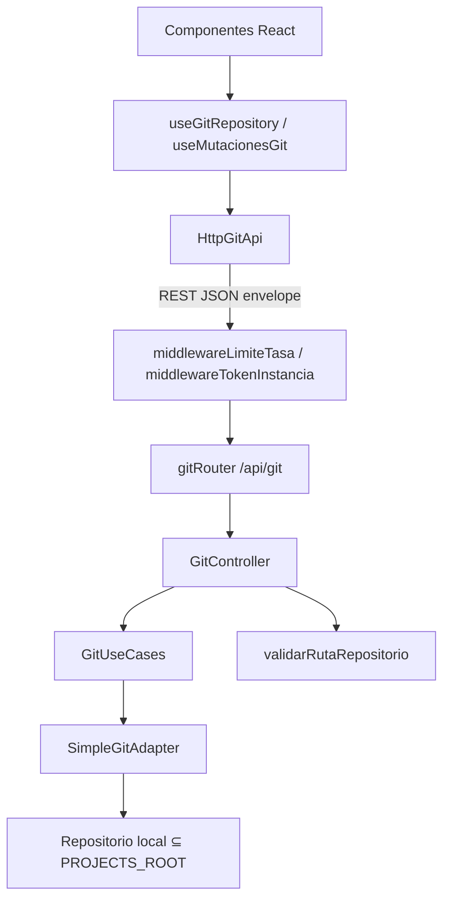

# Arquitectura

Abyssan es un monorepo pnpm con dos aplicaciones. El backend no es un wrapper de shell: las mutaciones Git atraviesan un único camino DDD.

## Organización del monorepo

```text
Abyssan/
├── apps/web/          # SPA React (Vite)
├── apps/server/       # API Express + WebSocket
├── docs/              # PRD, plan, esta wiki
├── docker-compose.yml
├── pnpm-workspace.yaml
└── package.json       # scripts de raíz
```

Workspaces: `apps/*` (`pnpm-workspace.yaml`). Scope npm interno: `@abyssan/web`, `@abyssan/server`.

## Responsabilidades

### `apps/web`

- UI: header, sidebar de ramas/tags, grafo DAG, staging, diff (Shiki), conflictos, consola, paleta, modales (stash, remotos, forjas, identidad git, timeline).
- Orquestación: `useGitRepository`, `useMutacionesGit`.
- Un cliente HTTP: `HttpGitApi`.
- WebSocket: `wsClient` (handshake `AUTH` si hay token, luego `WATCH_REPO`; escucha `REPO_CHANGED` y `OPERACION_PROGRESO`).
- Estado de UI en React; preferencias puntuales en `localStorage` (por ejemplo modo pull).

### `apps/server`

- HTTP REST bajo `/api/git`, `/api/auth`, `/api/forjas`.
- WebSocket en el mismo puerto que HTTP.
- Git vía `SimpleGitAdapter` (simple-git).
- Validación de rutas, token LAN, rate limit, cola de operaciones, journal, auditoría JSONL, watcher chokidar.
- Forjas (OAuth y PRs/MRs) **fuera** de `GitUseCases`, en `CasosUsoForja`.

## Capas

### Servidor (DDD ligero)

| Capa | Ruta | Rol |
|------|------|-----|
| Interfaces | `interfaces/http` | `GitRoutes`, `GitController`, `respuestaApi`, middleware de token |
| Aplicación | `application/use-cases/GitUseCases.ts` | Coordinación; cola; journal |
| Dominio | `domain/entities`, `domain/repositories/IGitRepository.ts` | Contratos y entidades |
| Infraestructura | `infrastructure/git/SimpleGitAdapter.ts` | Única implementación Git |
| Seguridad | `infrastructure/seguridad/` | `validarRutaRepositorio`, token, rate limit, `.env` |
| Watcher | `infrastructure/watcher/ChokidarWatcherAdapter.ts` | Un watcher por ruta de repo |
| Logging | `infrastructure/logging/InMemoryCommandLogAdapter.ts` | Log de comandos en memoria |
| Auditoría | `infrastructure/auditoria/AuditoriaJsonlAdapter.ts` | Append-only local, sin diffs |
| Deshacer | `application/deshacer/JournalOperaciones.ts` | Journal persistente |

### Frontend

| Capa | Ruta | Rol |
|------|------|-----|
| UI | `components/` | Producto |
| Aplicación | `application/hooks/` | Orquestación |
| Dominio | `domain/models/GitModels.ts` | Modelos alineados al API |
| Infraestructura | `infrastructure/api/HttpGitApi.ts` | REST |
| Servicios | `services/websocket.ts` | WS |

## Flujo de una solicitud



Nombres tomados del código. Las forjas usan `forjasRouter` → `ForjasController` → `CasosUsoForja` y el mismo `SimpleGitAdapter` para leer `origin`.

## Integración con simple-git

`SimpleGitAdapter` obtiene una instancia `simpleGit({ baseDir: repoPath })` y llama métodos o `git.raw([...])` con **arreglos de argumentos**, no con una cadena de shell.

## REST

Contrato de mutaciones y consultas bajo `/api/*` (excepto `/health`):

```json
{ "exito": true, "mensaje": "...", "datos": {}, "meta": {} }
```

`HttpGitApi` exige `exito: true` y entrega `datos` al resto de la UI. `/health` usa `{ status, producto, architecture, timestamp }`.

## WebSocket

El servidor crea `WebSocketServer` sobre el mismo `http.Server`.

| Dirección | Tipo | Contenido |
|-----------|------|-----------|
| Cliente → servidor | `AUTH` | `{ type, token }` (id de sesión o token permanente). `?token=` se ignora |
| Cliente → servidor | `WATCH_REPO` | `{ type, repoPath }` validado con `validarRutaRepositorio`. Exige sesión autenticada si el bind no es loopback |
| Cliente → servidor | `UNWATCH` | Deja de vigilar el repo actual |
| Servidor → cliente | `AUTH_OK` | Handshake aceptado |
| Servidor → cliente | `REPO_CHANGED` | `repoPath`, `eventType`, `filePath` relativo, `timestamp`. **No** envía el contenido del archivo |
| Servidor → cliente | `OPERACION_PROGRESO` | Metadatos de `GitOperacion`, solo a clientes que vigilan ese repo |
| Servidor → cliente | `ERROR` | Ruta no autorizada en `WATCH_REPO` |

Si el token LAN es obligatorio, hay 5 s para enviar `AUTH`. Fallo o `WATCH_REPO` prematuro: cierre `4401`. Origin no permitido: `4403`.

## Observación del filesystem

`ChokidarWatcherAdapter`: un watcher por `repoPath`, N oyentes (un cliente extra no pisa al primero). El último `close` cierra chokidar. Debounce 300 ms, ignora `node_modules`, objetos de `.git` y archivos ocultos. Profundidad 4.

## Estado

| Dónde | Qué |
|-------|-----|
| Proceso Node | Cola de operaciones, log de comandos, watchers, journal en memoria + disco |
| `ABYSSAN_HOME` o `~/.abyssan` | `auditoria.jsonl`, `journal.json`, `snapshots/`, credenciales OAuth cifradas |
| Navegador | Estado React; `localStorage` (modo pull); id de sesión en memoria (no `VITE_*` de token) |

Sin base de datos.

## Validación de repositorios

`validarRutaRepositorio` canoniza con `realpath` y exige contención en `PROJECTS_ROOT`. `validarRutaArchivoEnRepositorio` rechaza rutas absolutas y `..`. Clone/init: `validarDestinoNuevo` + `RemotePolicy`. Mutaciones (checkout, branch, merge, reset, cherry-pick, revert, tag) pasan por `validarRefGit` / `validarHashGit` en `GitUseCases`. Fetch, pull y push revalidan remotos persistidos (HTTPS/SSH). Ver [Registro-de-riesgos.md](./Registro-de-riesgos.md) y [Motor-operaciones-git.md](./Motor-operaciones-git.md).

## Restricciones

- Un adaptador Git. Un `HttpGitApi`.
- Forjas no bloquean Git local si la API remota falla (`ErrorForja`, típicamente 503).
- Preview no debe escribir el worktree (comandos de solo lectura como `merge-tree`). La UI llama `POST /api/git/preview` y muestra el resultado en `ModalConfirmacion` antes de mutar. Contrato: merge, reset, cherry-pick, revert.
- El grafo marca HEAD con la ref `%D` (`HEAD` / `HEAD -> rama`), no con la primera fila de `git log --all`.
- IA fuera del horizonte del producto.

## Siguiente

- [Operaciones Git](./Operaciones-Git.md)
- [Referencia de API](./Referencia-de-API.md)
- [Seguridad técnica](./Seguridad.md)
- [Home](./Home.md)
